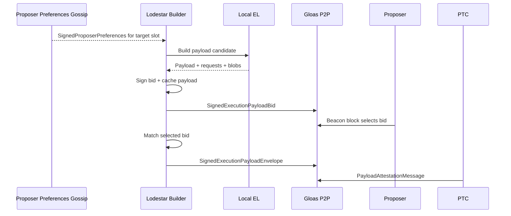
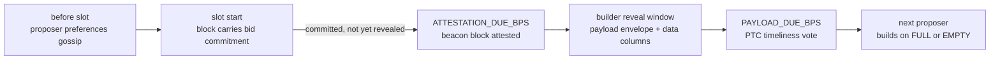
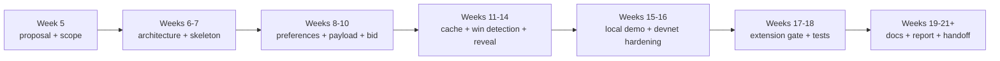

# Lodestar EIP-7732 Builder Proposal

Build an honest-path `lodestar builder` for EIP-7732 / Gloas that can produce local execution payloads, submit signed p2p bids, detect winning bids, and reveal matching payload envelopes. The Deathstar project is tracked as a builder-focused adversarial notebook from the start, with implementation only if the core Builder path is stable. FOCIL / Heze is tracked as future-fork compatibility context, with a possible adaptation pass only if FOCIL merges to `unstable` and the Builder work is far enough along.

**At a glance**

| Area | Role in this project |
| --- | --- |
| Core project | Implement the missing Lodestar Builder loop for EIP-7732 / Gloas |
| First success target | Local bid -> selection -> reveal demo |
| Strong-success extension | Heze / FOCIL adaptation pass, if FOCIL has merged to `unstable` and mentor guidance makes it useful |
| Stretch work | Builder-specific Deathstar scenario, only if Builder is stable |
| Future-fork context | FOCIL / Heze base-branch uncertainty, not a secondary deliverable |
| Companion doc | Living technical note for PR maps, mentor questions, moving specs, FOCIL context, and Deathstar notes |

## Motivation

Ethereum block production already relies heavily on proposer-builder separation, but today's production PBS flow depends on extra-protocol relay infrastructure. Validators outsource execution-payload construction to specialized builders, while relays mediate fair exchange between the proposer and builder. This has become important infrastructure, but it leaves a trusted intermediary in the middle of the protocol's most valuable path.

[EIP-7732](https://eips.ethereum.org/EIPS/eip-7732), enshrined proposer-builder separation or ePBS, moves that exchange into the protocol. Instead of including the full `ExecutionPayload` directly in the beacon block, the beacon block carries a signed builder commitment, `SignedExecutionPayloadBid`. The builder later reveals the matching payload through a `SignedExecutionPayloadEnvelope`, and Payload Timeliness Committee members attest whether the payload and blob data were revealed in time.

This project implements the missing Lodestar-side builder for that lifecycle. The [EPF7 project board](https://github.com/eth-protocol-fellows/cohort-seven/blob/master/projects/project-ideas.md#lodestar-eip-7732-builder) describes it as an in-protocol `lodestar builder` under EIP-7732 for Glamsterdam that will submit p2p bids every slot based on locally produced payloads from vanilla execution-layer software such as Nethermind or Ethrex, publish the payload if it wins, and pay the proposer through trustless payment. The purpose of this project is also exploratory. In other words, we aim to find spec gaps that need to be resolved for a consensus client to cleanly act as a builder.

The project touches block production, MEV, auctions, payload availability, fork choice, trustless payment, and censorship-resistance design. Vitalik's writing on [enshrinement](https://vitalik.eth.limo/general/2023/09/30/enshrinement.html) frames why some guarantees become stronger when the protocol can enforce them directly, and [The Scourge](https://vitalik.eth.limo/general/2024/10/20/futures3.html) frames block construction as a centralization-risk area. Mike Neuder and Justin Drake's [Why enshrine Proposer-Builder Separation?](https://ethresear.ch/t/why-enshrine-proposer-builder-separation-a-viable-path-to-epbs/15710) is directly relevant to the project's motivation. In-protocol PBS reduces relay trust, improves accountability, and makes the proposer-builder market protocol-native.

Prior EPF cohorts implemented the consensus side of ePBS in Prysm, Nimbus, and Lighthouse, all centered on the spec and the self-build path. Outside the clients, ethpandaops shipped [buildoor](https://github.com/ethpandaops/buildoor), a standalone builder+relay with an ePBS mode used for devnet lifecycle testing. What Lodestar does not yet have is a consensus-client-native builder actor. That is where this project sits, with buildoor as a reference implementation and interop peer.

Our research into this topic so far suggests Lodestar already has much of the Gloas infrastructure. Types, gossip topics, proposer-preference plumbing, bid validation, bid-pool logic, self-build paths, envelope validation, PTC logic, and builder registry work already exist in Lodestar. The missing piece is the external builder loop itself.

We also researched FOCIL / EIP-7805 because it affects future builder payload construction, but it is not in the scheduled Glamsterdam set -- the [Glamsterdam meta EIP-7773](https://eips.ethereum.org/EIPS/eip-7773) lists EIP-7805 under Declined for Inclusion -- and Lodestar already has substantial FOCIL work on a dedicated draft branch, with the Heze bid shape still moving ([consensus-specs #5410](https://github.com/ethereum/consensus-specs/pull/5410), proposes re-adding the inclusion-list bitlist to bids).

Deathstar is a better stretch fit for us. The project board describes it as an adversarial Lodestar node for causing chaos on Glamsterdam devnets, a builder creates natural adversarial cases, and a public [`deathstar` branch](https://github.com/ChainSafe/lodestar/tree/deathstar) with an ePBS chaos-feature catalog already exists. Our plan is to document the possible adversarial builder scenarios from the start, and attempt to implement them in Deathstar only if the honest Builder path is already in good shape.

## Project description

The project will implement and document an honest-path `lodestar builder` for EIP-7732 / Gloas. The builder observes proposer preferences, produces a local execution payload candidate using a normal execution-layer client, constructs and signs an `ExecutionPayloadBid`, publishes the resulting `SignedExecutionPayloadBid`, caches the exact payload data committed to by the bid, detects whether the bid was selected in a beacon block, and reveals the matching `SignedExecutionPayloadEnvelope`.

The smallest useful version is an honest builder that can complete this loop:

```text
SignedProposerPreferences
-> local execution payload
-> SignedExecutionPayloadBid
-> bid selected in beacon block
-> cached payload recovered
-> SignedExecutionPayloadEnvelope published
-> PTC can observe payload availability
```

Our goal is to add the missing builder-owned loop around infrastructure that already exists or is actively being implemented in Lodestar.



A baseline bid policy is enough for the first version. Therefore, we aim to first implement a fixed value or a fixed shade below a rough payload-value estimate for the initial simple bid policy. If the implementation stabilizes early, a more sophisticated policy becomes stretch work, using payload value, builder balance, pending payments, competing-bid assumptions, and free-option risk.

Deathstar is included only as a builder-specific stretch, fed by an adversarial notebook kept alongside the Builder work. FOCIL is included only as future-fork context and base-branch uncertainty. If FOCIL merges to `unstable` and the core Builder path is stable enough, a Heze / FOCIL adaptation pass can become strong-success work rather than a separate project. Our companion [living technical note](https://hackmd.io/PLACEHOLDER) tracks code-path maps, PR state, mentor questions, bid-policy notes, FOCIL context, and the Deathstar notebook.

## Specification

EIP-7732 removes the direct execution payload, blob commitments, and execution requests from the beacon block body; the body instead carries a `signed_execution_payload_bid` and payload attestations, with the full payload revealed later through a signed envelope. The [Gloas honest-builder spec](https://github.com/ethereum/consensus-specs/blob/dev/specs/gloas/builder.md) describes the builder as a staked actor that submits bids and later submits payloads; accepted bids commit the builder to pay the proposer whether or not the payload is submitted. The [p2p spec](https://github.com/ethereum/consensus-specs/blob/dev/specs/gloas/p2p-interface.md) defines the gossip surface (`execution_payload_bid`, `execution_payload`, `payload_attestation_message`, `proposer_preferences`) and its validation rules.

On the Lodestar side, the current code can already produce a block with a provided builder bid, and the self-build path constructs a bid with `BUILDER_INDEX_SELF_BUILD` (defined as `Infinity` in `packages/params`). The remaining gap is the external builder. The builder is an actor that owns a builder key, observes preferences, builds a payload, signs and publishes a bid, remembers the exact payload package the bid commits to, detects a win, and reveals the envelope.

A compact current-state map:

| Area | Current state | Builder work |
| --- | --- | --- |
| Gloas types and topics | Present / active in Lodestar | Reuse |
| Proposer preferences | Present from validator/proposer side | Consume from builder side |
| Bid validation and bid pool | Present / active | Produce valid bids |
| Self-build path | Present (`BUILDER_INDEX_SELF_BUILD`) | Generalize to external builder |
| Bid publication | Endpoint exists | Call from builder |
| Payload construction | Engine API path exists (`engine_getPayloadV6`) | Use as local payload source |
| Bid signing | Confirmed absent -- envelope signer exists as model | Add |
| Bid policy | Not a protocol concern | Baseline, leave room to improve |
| Bid -> payload cache | Builder-owned | Implement |
| Winning-bid detection | Builder-owned; event stream exposes needed topics | Implement |
| Envelope reveal | Validation/publish paths active | Build, sign, publish from builder |
| Devnet builder tooling | buildoor runs the ePBS lifecycle standalone | Interop peer / comparison target |
| Deathstar | Existing branch + chaos catalog | Stretch only after Builder works |

The first design question is where the builder should live. It could comprise a standalone `lodestar builder` command, a beacon-node service, a validator-client-adjacent service, or a temporary internal prototype that later becomes a command.

The builder needs valid proposer preferences before it can submit a trustless bid for a slot. These preferences come from the proposer/validator side and specify values the builder must respect, such as the proposer's `fee_recipient` and `target_gas_limit`. The builder should read them from gossip, an event stream, or Lodestar's internal pool, match them by `proposal_slot` and `dependent_root`, and skip the slot if no matching preferences are available.

Once the preferences are known, the builder can prepare a payload for that slot using Lodestar's existing Engine API / self-build preparation path, including `engine_getPayloadV6`. One open implementation detail is how to pass the proposer's `target_gas_limit` into the local execution client on a per-payload basis, since a static execution-client gas-limit setting cannot follow different proposer preferences slot by slot. The first version can start with the simplest local payload source that exercises the full bid -> reveal loop, then move toward a real execution client such as Ethrex or Nethermind and eventually a Glamsterdam devnet. For comparison and devnet testing, `ethereum-package` can also run buildoor as a dedicated per-participant ePBS builder.

The bid -> payload cache is safety-critical. A builder should only publish a bid if it can later recover the exact payload package committed to by that bid. That cache needs a stable key derived from the bid commitment, and it should fail closed on missing, expired, or mismatched entries rather than revealing a guessed payload.

Winning-bid detection then becomes the bridge between the cache and the reveal path. The builder observes imported or gossiped beacon blocks, inspects the selected `signedExecutionPayloadBid`, and checks whether it matches a locally cached bid. If it does, the builder loads the cached payload package, constructs and signs the matching `SignedExecutionPayloadEnvelope`, publishes it with the required blob / data-column sidecars, and records timing against the payload deadline. The `execution_payload_bid` event stream may also become useful later as a view of competing bids if the bid policy is upgraded. One policy question remains open for mentor input: whether the builder should reveal on first sight of a valid block, wait until block import, or make that behavior configurable for devnet testing.



## Roadmap



**Week 5 -- Proposal checkpoint.** Publish proposal + living note; align with Marko and Nico on scope, base branch, and the FOCIL/Deathstar stances; start the notebook. *Deliverable: accepted proposal and mentor-aligned scope.*

**Week 6 -- Architecture and code-path reconciliation.** Map the Gloas codepaths, confirm current PR state, propose where the builder should live, and get mentor sign-off before committing to the first implementation path. *Deliverable: architecture note and current-code map.*

**Week 7 -- Builder skeleton and configuration.** Skeleton service/command; config for key, index, BN access, EL endpoint, bid policy, cache, metrics; internal interfaces. *Deliverable: skeleton that starts and connects.*

**Week 8 -- Proposer preferences and slot targeting.** Read/subscribe, match by `proposal_slot` + `dependent_root`, skip invalid slots; tests for missing/stale/mismatched preferences. *Deliverable: builder identifies valid slots to bid on.*

**Week 9 -- Payload construction path.** Wrap the Engine API / self-build preparation path; capture payload, requests, blob data, parent roots; pick the first EL target. *Deliverable: payload candidate suitable for bid construction.*

**Week 10 -- Bid construction, signing, baseline policy.** Construct the bid; add the missing bid-signing method (fork-aware); `execution_payment = 0` on gossip; fixed-value or fixed-shade policy with caps. *Deliverable: a constructed, signed, valid bid.*

**Week 11 -- Bid publication and cache.** Publish via the existing p2p/API path; implement the bid -> payload cache with expiry, duplicates, and mismatch handling. *Deliverable: published bids whose exact payload package is recoverable.*

**Week 12 -- Winning-bid detection.** Observe blocks, match selected bids against the cache, define the reveal trigger, fail closed on partial matches. *Deliverable: reliable win detection.*

**Week 13 -- Envelope construction and signing.** Build and sign the envelope from cache; verify it matches the bid; tests for every mismatch class. *Deliverable: matching envelope for a selected bid.*

**Week 14 -- Envelope publication and data columns.** Publish the envelope; confirm blob/data-column handling on the external-builder path; log full slot timing. *Deliverable: payload revealed over the network path.*

**Week 15 -- Local end-to-end loop.** First full round on a local setup; reproduction runbook; metrics for bids, wins, reveals, cache, latency. *Deliverable: reproducible local demo.*

**Week 16 -- Devnet readiness and hardening.** Run against a Glamsterdam-style devnet (buildoor alongside for comparison); move to a real EL; harden timing/cache/fork-choice edges; document setup. *Deliverable: devnet-readiness note and hardened prototype.*

**Week 17 -- Extension gate.** Pick one: improved bid strategy, Heze / FOCIL adaptation if FOCIL has merged to `unstable`, one builder-specific Deathstar scenario, or continued hardening. *Deliverable: one focused extension or a stronger Builder.*

**Week 18 -- Integration tests and adversarial matrix.** Complete the builder failure-mode matrix; expand integration tests; land the chosen stretch. *Deliverable: expanded tests and completed matrix.*

**Week 19 -- PR polish and documentation.** Polish PRs; document service boundary, lifecycle, cache, signing, policies, timing assumptions. *Deliverable: reviewed implementation and docs draft.*

**Week 20 -- Final report and demo preparation.** Stabilize the demo; finalize PR descriptions; draft the final report. *Deliverable: report draft and demo instructions.*

**Week 21+ -- Final presentation and handoff.** Presentation; summarize merged/open PRs, tests, demo, stretch artifacts, follow-ups for maintainers and future fellows. *Deliverable: final EPF report, presentation, handoff.*

## Possible challenges

**Moving EIP-7732 / Gloas specs.** EIP-7732 is still Draft; roughly fifteen builder-adjacent spec changes landed in June alone (including `PAYLOAD_BUILDER_VERSION` and forced reorg of late payloads), beacon-APIs changed payload attributes as recently as July 2, consensus-specs #5410 reopens the Heze bid shape, draft EIPs 8237 and 8146 would each change the bid container itself (replacing `execution_requests_root` with an accumulator; adding a `block_access_list_hash` for a BAL sidecar), and a proposed merkleization change (EIP-7688) would shift every signing root. The builder must stay modular and absorb churn.

**Builder service boundary.** The cleanest home for `lodestar builder` is not obvious; the first prototype may need to live near existing beacon-node or validator-client services to reuse code.

**Base branch uncertainty.** `unstable`, a Glamsterdam devnet branch, or FOCIL-related work if Nico recommends it -- kept open deliberately.

**Builder identity, registration, and balance.** Builders onboard through dedicated EIP-8282 deposit/exit request contracts (deposits carry inline-verified proofs of possession; exits are authorized by the builder's execution address), need active status and excess balance covering bids plus pending payments, and Lodestar's `Infinity` self-build sentinel is not a valid `uint64`. Registration must be reproducible on a devnet, and deposit-signature verification is a known performance surface (Lodestar #9436).

**Payload cache correctness.** The exact bid -> payload mapping must survive to reveal; misses and mismatches fail closed. Recent envelope-cache and idempotency PRs show this path has real resource and correctness edge cases.

**Timing and PTC visibility.** The reveal must beat the payload deadline for the PTC -- and, since #5210, a late payload is forcibly reorged by the next proposer. Local success may not imply devnet success under real propagation.

**Bid policy.** Fixed-value is enough for the honest path, but a stronger builder eventually needs payload value, competing bids, balance constraints, canonical-inclusion risk, and free-option incentives -- an unbounded research surface kept behind the Week 17 gate.

## Goal of the project

The project is successful if Lodestar has a working, tested, and documented honest-path EIP-7732 builder prototype.

**Minimum success:** an architecture note; a builder service/command skeleton with configuration and key-handling design; proposer-preference lookup; a local payload-construction path; bid construction, signing, and p2p publication; the bid -> payload cache; winning-bid detection; envelope construction, signing, and publication; tests covering the core bid and reveal path; documentation of spec gaps, Lodestar gaps, devnet assumptions, and FOCIL base-branch context; and a Deathstar notebook of builder-specific adversarial cases.

**Strong success:** a reproducible local end-to-end demo, a real local execution client, a configurable bid policy, logs and metrics for bid/win/reveal/timing, one or more PRs merged or in review, a Heze / FOCIL adaptation pass if FOCIL has merged to `unstable` and mentor guidance makes it useful, and a final write-up of what existed, what was added, and what remains.

**Stretch success:** an improved bid policy beyond a fixed constant, a builder-adversarial Deathstar matrix with one or two implemented scenarios, a deeper write-up of builder bidding constraints under ePBS, and follow-up issues for future adversarial builder work.

The project counts as finished and successful if the honest builder loop is implemented and documented.

## Collaborators

### Fellows

- [Kris O'Shea](https://github.com/krisoshea-eth)
- [Marko Lazic](https://github.com/markolazic01)

### Mentors

- [Nico Flaig](https://github.com/nflaig) -- Lodestar (ChainSafe); co-author of EIP-7732; listed mentor for both the Builder and Deathstar project ideas.

## Resources

- **[Living technical note](https://hackmd.io/PLACEHOLDER)** -- companion document: full PR map, code-path map, cache design, bid-policy notes, Deathstar notebook, resource library
- [EIP-7732](https://eips.ethereum.org/EIPS/eip-7732) - Gloas [builder](https://github.com/ethereum/consensus-specs/blob/dev/specs/gloas/builder.md) and [p2p](https://github.com/ethereum/consensus-specs/blob/dev/specs/gloas/p2p-interface.md) specs - [EIP-7773 (Glamsterdam meta)](https://eips.ethereum.org/EIPS/eip-7773) - [EIP-8282 (builder deposits/exits)](https://eips.ethereum.org/EIPS/eip-8282)
- EPF7 project ideas: [Builder](https://github.com/eth-protocol-fellows/cohort-seven/blob/master/projects/project-ideas.md#lodestar-eip-7732-builder) - [Deathstar](https://github.com/eth-protocol-fellows/cohort-seven/blob/master/projects/project-ideas.md#lodestar-adversarial-node)
- [Lodestar](https://github.com/ChainSafe/lodestar) - the builder gap: [`produceBlockBody.ts`](https://github.com/ChainSafe/lodestar/blob/unstable/packages/beacon-node/src/chain/produceBlock/produceBlockBody.ts) - [Deathstar chaos catalog](https://github.com/ChainSafe/lodestar/blob/deathstar/EPBS_CHAOS_FEATURES.md)
- [buildoor](https://github.com/ethpandaops/buildoor) - [ethereum-package](https://github.com/ethpandaops/ethereum-package) - [glamsterdam-devnet-6](https://dora.glamsterdam-devnet-6.ethpandaops.io/)
- [Why enshrine PBS?](https://ethresear.ch/t/why-enshrine-proposer-builder-separation-a-viable-path-to-epbs/15710) - [PTC: an ePBS design](https://ethresear.ch/t/payload-timeliness-committee-ptc-an-epbs-design/16054) - [The Free Option Problem in ePBS](https://collective.flashbots.net/t/the-free-option-problem-in-epbs/5115) - [Who Wins Ethereum Block Building Auctions and Why?](https://drops.dagstuhl.de/entities/document/10.4230/LIPIcs.AFT.2024.22) - [Block vs. Slot Auction PBS](https://mirror.xyz/julianma.eth/CPYI91s98cp9zKFkanKs_qotYzw09kWvouaAa9GXBrQ) (Ma)
